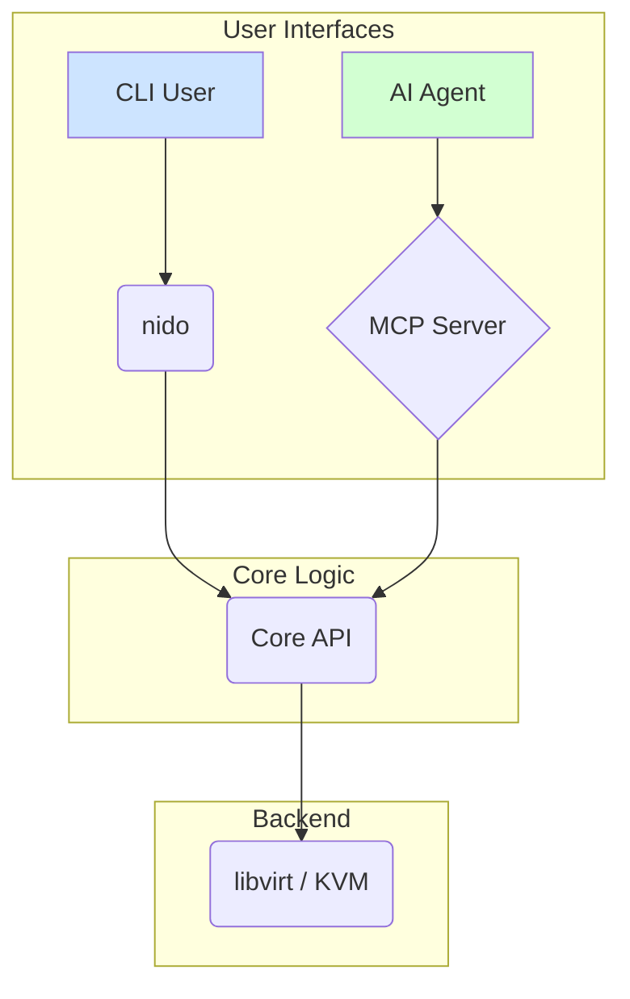

# VM Ops - Specifica Tecnica: Integration & Ecosystem

**Autore:** Manus AI
**Data:** 4 Gennaio 2026
**Versione:** 1.0

## 1. Introduzione

Questo documento fornisce una specifica tecnica dettagliata per le features della **Categoria 4: Integration & Ecosystem** del progetto VM Ops. L'obiettivo è trasformare VM Ops in un tool di riferimento per l'automazione di infrastruttura locale, accessibile sia da operatori umani tramite Command Line Interface (CLI), sia da agenti AI tramite protocolli standardizzati.

La vision è posizionare VM Ops come il **ponte tra la gestione VM locale e il mondo emergente degli agenti AI**, fornendo un'interfaccia programmatica robusta, sicura e standard, con il **Model Context Protocol (MCP)** come fulcro.

## 2. Architettura Dual-Mode: CLI + MCP

VM Ops adotterà un'architettura dual-mode per servire entrambi i tipi di utenti (umani e AI) in modo nativo, senza compromessi. Entrambe le interfacce condivideranno una logica di base (Core API) per garantire consistenza e manutenibilità.

> L'architettura dual-mode permette a VM Ops di mantenere la sua semplicità e velocità per l'uso interattivo da CLI, aggiungendo al contempo un potente layer di automazione programmatica per l'integrazione con sistemi esterni e agenti AI.



### 2.1. Core API (Shared Logic)

Il cuore di VM Ops sarà una libreria di funzioni shell (Core API) che astrae le operazioni su libvirt/KVM. Questa logica sarà condivisa e richiamata sia dalla CLI che dal MCP Server. Questo garantisce che le azioni siano identiche indipendentemente da come vengono invocate.

**Moduli Principali:**

| Modulo | Responsabilità |
|---|---|
| `vm_manager.sh` | Lifecycle: spawn, create, start, stop, delete |
| `template_manager.sh` | Gestione dei template compressi |
| `exec_manager.sh` | Esecuzione comandi e gestione file nelle VM |
| `snapshot_manager.sh` | Creazione e ripristino di snapshot |
| `network_manager.sh` | Configurazione di rete e port forwarding |


## 3. Model Context Protocol (MCP) Server

Il componente centrale dell'ecosistema di integrazione è il **MCP Server**. Questo server espone le funzionalità di VM Ops come "tools" che possono essere scoperti e invocati da client MCP-compatibili, come Claude, OpenAI Agents e futuri assistenti AI. [1]

### 3.1. Avvio del Server

Il server MCP sarà avviato tramite un nuovo comando della CLI:

```bash
# Avvia il server in modalità stdio (default, per client locali come Claude Desktop)
nido mcp-server start

# Avvia il server in modalità HTTP + SSE su una porta specifica
nido mcp-server start --transport http --port 8080
```

### 3.2. Transport Supportati

Saranno supportati due meccanismi di trasporto per massima compatibilità:

| Transport | Protocollo | Use Case Primario |
|---|---|---|
| `stdio` | Standard I/O | Integrazione locale con client desktop (e.g., Claude Desktop) |
| `http` | HTTP + Server-Sent Events (SSE) | Integrazione con client remoti o web-based |

### 3.3. Tools Esposti via MCP

I tools sono il cuore dell'integrazione MCP. Definiscono le azioni che un agente AI può compiere. Ogni tool è definito da un nome, una descrizione e uno schema JSON per input e output, come da specifica MCP. [2]

Di seguito la lista completa dei tools che VM Ops esporrà.

#### 3.3.1. Gestione Lifecycle VM

| Tool | Descrizione | Annotazioni |
|---|---|---|
| `vm_ls` | Elenca le macchine virtuali disponibili. | `safe` |
| `vm_spawn` | Crea e avvia una nuova VM. | `long_running` |
| `vm_create` | Crea una nuova VM (senza avvio). | `safe` |
| `vm_start` | Avvia una VM esistente. | `safe` |
| `vm_stop` | Ferma una VM in esecuzione. | `safe` |
| `vm_delete` | Distrugge permanentemente una VM. | `destructive`, `confirmation_required` |
| `vm_info` | Ottiene informazioni dettagliate su una VM. | `safe` |

**Esempio di definizione per `vm_create`:**

```json
{
  "name": "vm_create",
  "title": "Create New Virtual Machine",
  "description": "Creates a new VM from a compressed template. This is a long-running operation that will send progress notifications.",
  "inputSchema": {
    "type": "object",
    "properties": {
      "name": {
        "type": "string",
        "description": "A unique name for the new VM (e.g., 'web-server-1')."
      },
      "template": {
        "type": "string",
        "description": "The name of the template to use. Use 'template_list' to see available templates."
      }
    },
    "required": ["name", "template"]
  },
  "outputSchema": {
    "type": "object",
    "properties": {
      "name": { "type": "string" },
      "status": { "type": "string" },
      "ip_address": { "type": "string" },
      "ssh_command": { "type": "string", "description": "Command to connect to the VM via SSH." }
    }
  }
}
```

#### 3.3.2. Esecuzione Comandi e File

| Tool | Descrizione | Annotazioni |
|---|---|---|
| `vm_exec` | Esegue un comando shell all'interno di una VM. | `potentially_dangerous` |
| `vm_upload` | Carica un file dall'host alla VM. | `safe` |
| `vm_download` | Scarica un file dalla VM all'host. | `safe` |

**Esempio di definizione per `vm_exec`:**

```json
{
  "name": "vm_exec",
  "title": "Execute Command in VM",
  "description": "Executes a shell command inside a specified VM via SSH and returns the standard output, standard error, and exit code.",
  "inputSchema": {
    "type": "object",
    "properties": {
      "name": {
        "type": "string",
        "description": "The name of the target VM."
      },
      "command": {
        "type": "string",
        "description": "The shell command to execute (e.g., 'ls -l /app')."
      },
      "timeout_seconds": {
        "type": "number",
        "default": 60,
        "description": "Maximum execution time in seconds."
      }
    },
    "required": ["name", "command"]
  },
  "outputSchema": {
    "type": "object",
    "properties": {
      "stdout": { "type": "string" },
      "stderr": { "type": "string" },
      "exit_code": { "type": "number" }
    }
  }
}
```

#### 3.3.3. Gestione Template e Snapshot

| Tool | Descrizione | Annotazioni |
|---|---|---|
| `template_list` | Elenca i template VM disponibili. | `safe` |
| `template_create` | Crea un nuovo template da una VM esistente. | `long_running` |
| `vm_snapshot` | Crea uno snapshot dello stato di una VM. | `safe` |
| `vm_restore` | Ripristina una VM da uno snapshot. | `destructive` |

### 3.4. Risorse Esposte

Per fornire contesto agli agenti AI, VM Ops esporrà delle risorse dinamiche:

- `vmops://vms`: Una lista sempre aggiornata delle VM e del loro stato.
- `vmops://templates`: Il catalogo dei template disponibili.
- `vmops://vm/{name}/logs`: Gli ultimi log di una specifica VM.

### 3.5. Prompts Predefiniti

Per semplificare workflow comuni, saranno disponibili dei prompts (workflow template):

- **`deploy_and_test`**: Automatizza la creazione di una VM, il deploy di un'applicazione da un repo Git, l'esecuzione di test e il reporting dei risultati.
- **`quick_sandbox`**: Crea una VM effimera per test rapidi, che si auto-distrugge dopo un timeout definito.


## 4. Webhook & Event System

Per un'integrazione proattiva, VM Ops includerà un sistema di eventi e webhook. Questo permetterà di notificare sistemi esterni (es. Slack, PagerDuty, CI/CD) al verificarsi di eventi specifici nel ciclo di vita delle VM.

### 4.1. Eventi Supportati

| Evento | Descrizione |
|---|---|
| `vm.created` | Una nuova VM è stata creata con successo. |
| `vm.started` | Una VM è stata avviata. |
| `vm.stopped` | Una VM è stata fermata. |
| `vm.deleted` | Una VM è stata distrutta. |
| `vm.crashed` | Una VM è andata in crash inaspettatamente. |
| `template.created`| Un nuovo template è stato creato. |

### 4.2. Gestione Webhook via CLI

```bash
# Aggiunge un nuovo webhook per notificare su Slack quando una VM va in crash
nido webhook add --event vm.crashed --url https://hooks.slack.com/services/...

# Lista i webhook attivi
nido webhook list

# Rimuove un webhook
nido webhook remove <webhook_id>
```

### 4.3. Payload dell'Evento

Il payload inviato al webhook sarà un JSON strutturato contenente informazioni sull'evento.

**Esempio di payload per `vm.crashed`:**

```json
{
  "event": "vm.deleted",
  "timestamp": "2026-01-04T14:30:00Z",
  "vm_name": "prod-web-server-1",
  "details": {
    "ip_address": "192.168.122.45",
    "last_log_entries": [
      "...",
      "..."
    ]
  }
}
```

## 5. API REST Mode

Oltre a MCP, che è orientato agli agenti, VM Ops esporrà una API REST tradizionale per integrazioni programmatiche più classiche. Questo rende VM Ops controllabile da qualsiasi script o applicazione che possa effettuare chiamate HTTP.

### 5.1. Avvio del Server API

```bash
nido api-server start --port 8080 --allow-remote
```

### 5.2. Endpoint Principali

L'API ricalcherà le funzionalità dei tools MCP, ma seguendo le convenzioni REST.

| Metodo | Endpoint | Descrizione |
|---|---|---|
| `GET` | `/v1/vms` | Lista tutte le VM |
| `POST` | `/v1/vms` | Crea una nuova VM |
| `GET` | `/v1/vms/{name}` | Dettagli di una VM |
| `DELETE` | `/v1/vms/{name}` | Elimina una VM |
| `POST` | `/v1/vms/{name}/start` | Avvia una VM |
| `POST` | `/v1/vms/{name}/stop` | Ferma una VM |
| `POST` | `/v1/vms/{name}/exec` | Esegue un comando in una VM |

## 6. Integrazione CI/CD

Per integrare VM Ops nei workflow di Continuous Integration/Continuous Deployment, sarà creata un'azione GitHub (GitHub Action) ufficiale. Questo permetterà di usare VM Ops per creare ambienti di test effimeri direttamente nelle pipeline di GitHub.

### 6.1. Esempio di GitHub Action

Un workflow di test potrebbe apparire così in `.github/workflows/test.yml`:

```yaml
name: Run Integration Tests

on: [push]

jobs:
  test:
    runs-on: ubuntu-latest
    steps:
    - name: Checkout code
      uses: actions/checkout@v4

    - name: Setup VM Ops
      uses: vm-ops/setup-action@v1

    - name: Run tests in an ephemeral VM
      uses: vm-ops/run-in-vm-action@v1
      with:
        template: ubuntu-22.04-docker
        script: |
          npm install
          npm test
```

Questo approccio permette di avere test completamente isolati e riproducibili, sfruttando la velocità dei template compressi di VM Ops.


## 7. Sicurezza e Controllo

L'integrazione con agenti AI introduce nuove sfide di sicurezza. L'architettura di VM Ops affronterà queste sfide con un approccio multi-livello.

### 7.1. Consenso dell'Utente e Human-in-the-Loop

Seguendo le best practice di MCP, nessuna azione distruttiva o potenzialmente pericolosa sarà eseguita senza un meccanismo di conferma. [3]

- **Annotazioni dei Tool**: I tool MCP saranno annotati con flag come `destructive` e `confirmation_required`. I client MCP (come Claude) useranno queste annotazioni per richiedere conferma all'utente prima di procedere.
- **Whitelist di Comandi**: Per il tool `vm_exec`, sarà possibile configurare una whitelist di comandi permessi per limitare l'esecuzione a operazioni sicure.

### 7.2. Audit Logging

Tutte le operazioni eseguite tramite MCP o API REST saranno registrate in un log di audit immutabile, per garantire tracciabilità e accountability.

```
# /var/log/nido/mcp-audit.log

2026-01-04T15:00:12Z [MCP] agent='claude-desktop' tool='vm_create' params='{"name":"test-vm-1"}' result='success'
2026-01-04T15:01:05Z [MCP] agent='claude-desktop' tool='vm_exec' params='{"name":"test-vm-1", "command":"rm -rf /"}' result='denied' reason='dangerous_command'
```

## 8. Roadmap di Implementazione

L'implementazione di queste features seguirà un approccio iterativo.

| Fase | Durata Stimata | Focus | Deliverables Chiave |
|---|---|---|---|
| **1** | 2-3 settimane | MCP Server Base | `nido mcp-server`, transport `stdio`, tool di lifecycle VM (spawn, ls, delete). |
| **2** | 1-2 settimane | Esecuzione Remota | Tool `vm_exec`, `vm_upload`, `vm_download`, notifiche di progresso. |
| **3** | 1-2 settimane | API REST & Webhooks | `nido api-server`, sistema di eventi e gestione webhook. |
| **4** | 1-2 settimane | CI/CD e Polish | GitHub Action per test, documentazione completa, hardening sicurezza. |

## 9. Protocolli Futuri e Alternative

Il panorama dei protocolli per agenti AI è in rapida evoluzione. Oltre a MCP, sono stati analizzati altri standard emergenti.

- **A2A (Agent-to-Agent) Protocol**: Sviluppato da Google e ora sotto la Linux Foundation, A2A si focalizza sulla comunicazione orizzontale tra agenti, mentre MCP è verticale (host-tool). [4] A2A è complementare e potrà essere integrato in futuro per scenari multi-agente.
- **OpenAI Function Calling**: È lo standard de facto nell'ecosistema OpenAI, ma è proprietario. MCP è uno standard aperto e cross-vendor, che lo rende una scelta più strategica per un tool open source come VM Ops.

La scelta di MCP come protocollo primario garantisce la più ampia compatibilità con l'ecosistema AI attuale e futuro.

---

## Riferimenti

[1] Model Context Protocol. "Specification 2025-06-18". *modelcontextprotocol.io*. [https://modelcontextprotocol.io/specification/2025-06-18](https://modelcontextprotocol.io/specification/2025-06-18)

[2] Model Context Protocol. "Tools Specification". *modelcontextprotocol.io*. [https://modelcontextprotocol.io/specification/2025-06-18/server/tools](https://modelcontextprotocol.io/specification/2025-06-18/server/tools)

[3] Red Hat. "Model Context Protocol (MCP): Understanding security risks and controls". *redhat.com*. [https://www.redhat.com/en/blog/model-context-protocol-mcp-understanding-security-risks-and-controls](https://www.redhat.com/en/blog/model-context-protocol-mcp-understanding-security-risks-and-controls)

[4] A2A Project. "A2A GitHub Repository". *github.com*. [https://github.com/a2aproject/A2A](https://github.com/a2aproject/A2A)
