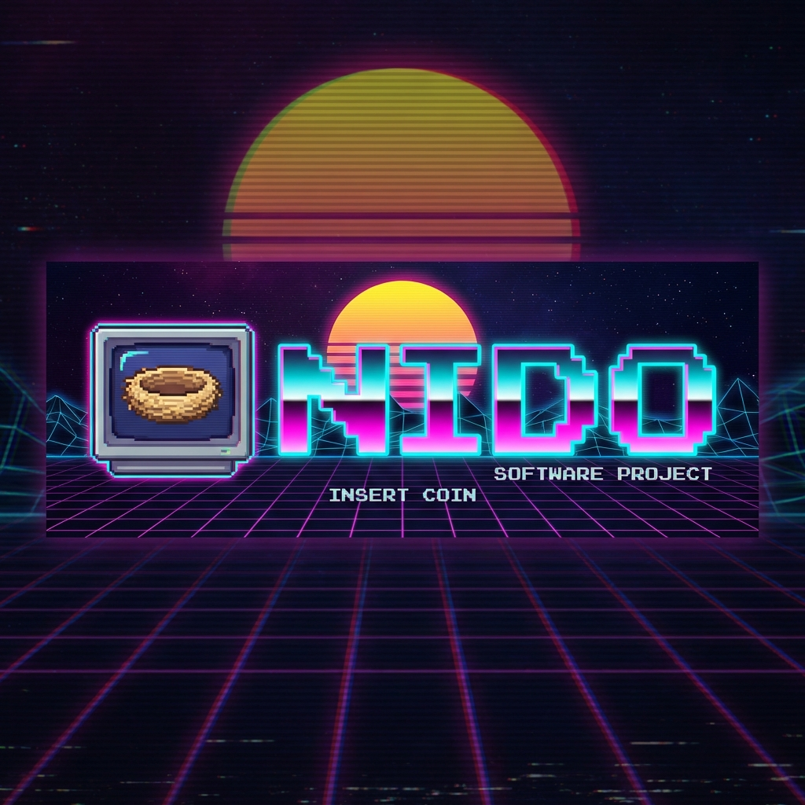

# 

> **"It's not a container. It's a lifestyle."** 🐣💾

[](https://github.com/Josepavese/nido/releases)
[](LICENSE)
[](https://goreportcard.com/report/github.com/Josepavese/nido)

**Nido** is a hyper-fast, AI-first automation tool that **spawns real Virtual Machines** in milliseconds.

Containers are cages. Your AI agents deserve a **Home**. A Nest. 🪺

Built on QEMU and fueled by 80s nostalgia, Nido gives your autonomous agents a full constrained-free Operating System to break things in, fix them, and fly away without leaving a trace.

---

## 🕹️ The Concept: Spawn -> Execute -> Destroy


1. **INSERT COIN (Spawn)**: An agent requests a VM. Nido hatches one from a cached image instantly using **Linked Clones** (Copy-on-Write).
2. **PLAY (Execute)**: The agent has full `root` access. No shared kernels. No syscall filters. Pure freedom.
3. **GAME OVER (Destroy)**: The task is done. The VM is vaporized. The host system remains pristine.

---

## ⚡ Loading... (Installation)

> **SYSTEM REQUIREMENTS:** Linux, macOS, or Windows (WSL2/PowerShell). QEMU must be installed.

### 💾 Quick Install (Web)

Run this command in your terminal. Do not turn off the console while saving.

**Linux & macOS:**

```bash
curl -fsSL https://raw.githubusercontent.com/Josepavese/nido/main/installers/quick-install.sh | bash
source ~/.nido/env   # Power up the path
nido version         # Check checksum
```

**Windows (PowerShell):**

```powershell
irm https://raw.githubusercontent.com/Josepavese/nido/main/installers/quick-install.ps1 | iex
# Restart your terminal to initialize the matrix
nido version
```

---

## 🦾 Neural Interface (For AI Agents)

Nido is designed to be driven by **Large Language Models** (Claude, GPT-4, Gemini).

### 🤖 Model Context Protocol (MCP)

Nido speaks the universal language of agents. It includes a built-in **MCP Server** that exposes `vm_spawn`, `vm_exec`, and `vm_prune` tools directly to your AI.

```bash
# Register Nido with your Claude Desktop or Agent configuration
nido register
```

### 🧠 JSON Mode

Every command supports `--json` for structured, machine-readable output. No distinct parsing required.

```bash
nido spawn test-vm --image ubuntu:24.04 --json
# Output: {"status": "hatched", "ip": "10.0.2.15", "ssh_port": 34822}
```

---

## 🕹️ Player 1 Controls (CLI)

The CLI feels like a modern tool but remembers where it came from. Fast. Typed. Colorful.

| Command | Action | Arcade Analog |
| :--- | :--- | :--- |
| `nido spawn <name>` | Create a new VM | **START GAME** |
| `nido ssh <name>` | Connect via SSH | **LINK CABLE** |
| `nido gui` | Open TUI Dashboard | **ARCADE MODE** |
| `nido delete <name>` | Destroy VM | **GAME OVER** |
| `nido images pull` | Download OS Image | **LOAD ROM** |
| `nido uninstall` | Remove Nido completely | **SELF DESTRUCT** |

**Pro Tip:** Use `nido gui` to enter the **Arcade Dashboard**. It features a retro-futuristic interface, real-time stats, and a synthesizer-inspired color palette.

---

## 📼 Features Tape

* **⚡ Instant Start**: Uses QCOW2 backing chains. Boots in seconds. Uses <1MB disk space per clone.
* **🔌 Universal Networking**: Auto-forwarded SSH ports. HTTP/HTTPS ports mapped automatically.
* **📺 TUI Dashboard**: A full terminal user interface for monitoring your fleet. 80s aesthetics included.
* **📦 Smart Registry**: Pulls optimized, cloud-init ready images (`ubuntu`, `alpine`, `debian`, `arch`).
* **🖥️ Desktop Integration**: Creates native launchers on Linux, macOS, and Windows. Alt-Tab to your VMs!
* **🍳 Nuclear Uninstall**: `nido uninstall` cleans up everything. No artifacts left behind.

---

## 🧬 Killer Feature: Linked Clones

Why download 2GB every time? Nido downloads the generic "Common ROM" (Base Image) once.

Every VM you spawn is just a **diff layer** on top of that ROM.
* **Base Image:** Read-Only. Safe.
* **VM Disk:** Read-Write. Ephemeral.

**Result:** Spawn 100 VMs, use disk space for 1. 🚀

---

## 🤝 Contributing

**Insert Coin to Join.**

1. Fork the repo.
2. `go run ./cmd/nido gui` to test the Arcade UI.
3. Submit a PR.
4. High Scores are recorded in `AUTHORS`.

## 📜 License

MIT License. Free as in "Free Play".

---

<p align="center">
  <i>Made with 💜 and ☕ by digital artisans.</i><br>
  <i>EST. 2025 • "The Grid. A digital frontier."</i>
</p>
