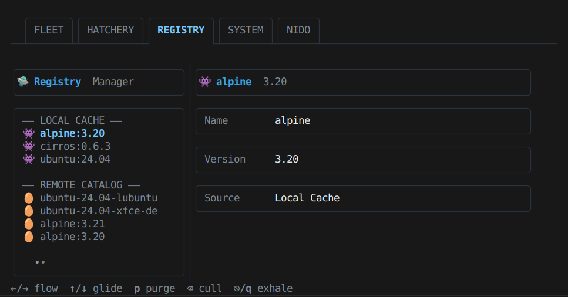

# 

Hatch a VM, do the work, let it fly away. Your AI agents will feel at home.

Nido is a **fast, lightweight, AI-first VM automation tool**.

You install it in seconds, get a clean CLI, and AI agents can start spawning **real virtual machines** immediately.
No clusters. No dashboards. No babysitting.

Built on QEMU and hardware acceleration, Nido feels like a small CLI —
but it gives agents what containers can’t: **a full operating system, on demand**.

Think of it as a nest 🪺 for automation:
machines hatch 🐣, do their job, and fly away 🐦.

If your AI workflows need a real OS with zero friction, Nido stays out of the way and lets them run.

---

## Use case: hatch, fix, fly away

Say a CI agent needs a clean OS to reproduce a bug, apply a patch, and leave nothing behind.
With Nido, it hatches a VM from an image **even if it isn't local yet**, does the job, and lets it fly away. 🐣🐦

```bash
# 1) See what's in the nest (no download yet)
nido images list

# 2) Hatch fast: Nido pulls the image on the fly if it's not cached
nido spawn bugfix-vm --image ubuntu:24.04

# 3) (optional) hop in and do the work
nido ssh bugfix-vm

# 4) Cleanup at light speed
nido delete bugfix-vm
```

Bottom line: a real OS as an execution surface for agents, minus the babysitting.

## Quick Start

### 1. Installation

> **⚡ Lightning-Fast Install** - Just ~4MB download. No Git required!

#### Linux & macOS

```bash
curl -fsSL https://raw.githubusercontent.com/Josepavese/nido/main/installers/quick-install.sh | bash
source ~/.bashrc  # or ~/.zshrc
nido version
```

#### Windows (PowerShell)

```powershell
irm https://raw.githubusercontent.com/Josepavese/nido/main/installers/quick-install.ps1 | iex
# Restart terminal, then:
nido version
```

> **📖 More Options:** See [`installers/README.md`](installers/README.md) for alternative installation methods, including a lightweight build-from-source option for tinkerers who want bleeding-edge features without cloning the entire repository.

#### Manual Installation (All Platforms)

Download the latest binary from [GitHub Releases](https://github.com/Josepavese/nido/releases/latest):

```bash
# Linux
curl -L https://github.com/Josepavese/nido/releases/latest/download/nido-linux-amd64 -o nido
chmod +x nido && sudo mv nido /usr/local/bin/

# macOS (Intel)
curl -L https://github.com/Josepavese/nido/releases/latest/download/nido-darwin-amd64 -o nido
chmod +x nido && sudo mv nido /usr/local/bin/

# macOS (Apple Silicon)
curl -L https://github.com/Josepavese/nido/releases/latest/download/nido-darwin-arm64 -o nido
chmod +x nido && sudo mv nido /usr/local/bin/
```

#### Install QEMU (Required)

Nido needs QEMU to run VMs:

```bash
# Linux (Debian/Ubuntu)
sudo apt install qemu-system-x86 qemu-utils

# macOS
brew install qemu

# Windows
choco install qemu
```

> **💡 Tip:** Run `nido doctor` after installation to verify your setup!

### 2. Usage

```bash
# The essentials
nido spawn my-vm                   # Hatch a new VM from default template
nido ls                            # List all life forms in the nest
nido ssh my-vm                     # Instant bridge via SSH
nido stop my-vm                    # Put VM into deep sleep
nido delete my-vm                  # Evict VM permanently

# Template management
nido template list                 # See what's in cold storage
nido template create my-vm golden  # Archive VM as reusable template
nido template delete golden        # Erase template from history

# Power user moves
nido start my-vm                   # Revive a stopped VM
nido prune                         # Vaporize all stopped VMs
nido info my-vm                    # Inspect neural links (IP, Port)
nido doctor                        # Run system health check
nido config                        # View current genetics
nido help                          # Show detailed usage instructions

# AI agent setup
nido register                      # Get MCP config for Claude/Antigravity

# Image & Cache Management 🆕
nido images list                    # Browse cloud images (shows file sizes)
nido images pull ubuntu:24.04       # Pull official Ubuntu 24.04 image
nido cache ls                       # List cached images and their sizes
nido cache info                     # Show cache stats (total size, age)
nido spawn my-vm --image ubuntu:24.04  # Spawn directly from any cloud image
```

## Killer Feature: Linked Clones 🧬

This is Nido's secret weapon for speed and efficiency.

By default, Nido uses **Linked Clones** technology (QCOW2 `backing_file` backing).
When you spawn a VM from an image (e.g., `ubuntu:24.04`), Nido **does not copy the whole 2GB file**.

Instead, it creates a tiny overlay file that only stores the *changes* you make.

### Space Savings Simulation

| Setup                      | Traditional VM / Full Copy | Nido Linked Clones         |
| :------------------------- | :------------------------- | :------------------------- |
| **Base Image**       | 2.5 GB                     | 2.5 GB (Stored once)       |
| **VM 1**             | 2.5 GB                     | **< 1 MB** (Overlay) |
| **VM 2**             | 2.5 GB                     | **< 1 MB** (Overlay) |
| **VM 10**            | 2.5 GB                     | **< 1 MB** (Overlay) |
| **Total for 10 VMs** | **~27.5 GB** 😱      | **~2.6 GB** 🚀       |

### Smart Cache Protection 🛡️

Because VMs depend on the base image, you might worry about deleting it.
Don't. Nido's `cache prune` command is smart: **it refuses to delete any image that is active**.

### Quick Configuration

If you prefer completely independent VMs (e.g., for exporting a single file), you can disable this:

```bash
nido config set LINKED_CLONES false
```

When disabled, Nido performs a full copy of the image and deletes the downloaded cache file to save space (since the data is now in the VM disk).

## Nido Flavours & Split Distribution 🧁📦

Nido Flavours are pre-built, optimized VM environments (like Lubuntu, XFCE, or specialized dev stacks) maintained by the community.

To bypass storage limits and ensure fast downloads:

- **Zero-Touch Registry:** Flavours are automatically discovered from GitHub Releases using our smart scanning strategy. No manual registration needed. 🤖
- **Split Distribution:** Large images (>2GiB) are automatically distributed in segments via GitHub Releases to ensure high availability.
- **Auto-Reassembly:** `nido` handles multi-part downloads and reassembles images on the fly.
- **Trusted Provenance:** Recognized flavours are marked with a bold `[PRECONFIGURED]` badge in `nido image list`.

## Shell Completion 🆕

`nido` now supports full shell completion for **Bash** and **Zsh**. Never guess a command or template name again!

```bash
# Generate completion script (Bash)
nido completion bash > ~/.nido/bash_completion
echo "source ~/.nido/bash_completion" >> ~/.bashrc

# Generate completion script (Zsh)
mkdir -p ~/.zsh/completion
nido completion zsh > ~/.zsh/completion/_nido
echo "fpath=(~/.zsh/completion \$fpath)" >> ~/.zshrc
echo "autoload -Uz compinit && compinit" >> ~/.zshrc
```

## Commands

| Command                                | What it does                            | Example                                     |
| :------------------------------------- | :-------------------------------------- | :------------------------------------------ |
| `spawn <name> [--image  --gui]` | Create and start a VM with optional GUI | `nido spawn vm1 --image xfce:24.04 --gui` |
| `start <name> [--gui]`               | Revive a stopped VM with optional GUI   | `nido start test-vm --gui`                |
| `stop <name>`                        | Put VM into deep sleep                  | `nido stop test-vm`                       |
| `delete <name>`                      | Evict VM permanently                    | `nido delete test-vm`                     |
| `prune`                              | Remove all stopped VMs                  | `nido prune`                              |
| `ls`                                 | List all VMs                            | `nido ls`                                 |
| `info <name>`                        | Get VM details                          | `nido info test-vm`                       |
| `ssh <name>`                         | SSH into VM                             | `nido ssh test-vm`                        |
| `image list`                         | List cloud images                       | `nido image list`                         |
| `image pull <image>`                 | Download image                          | `nido image pull ubuntu:24.04`            |
| `template list`                      | List templates                          | `nido template list`                      |
| `template create <vm> <tpl>`         | Archive VM                              | `nido template create my-vm golden`       |
| `template delete <name> [--force]`   | Delete template                         | `nido template delete golden --force`     |
| `doctor`                             | System diagnostics                      | `nido doctor`                             |
| `config`                             | View configuration                      | `nido config`                             |
| `register`                           | MCP setup helper                        | `nido register`                           |
| `cache ls`                           | List cached images                      | `nido cache ls`                           |
| `cache info`                         | Show cache statistics                   | `nido cache info`                         |
| `cache prune`                        | Remove all cached images                | `nido cache prune`                        |
| `help`                               | Show usage information                  | `nido help`                               |

### Structured Output (JSON)

For automation and GUI integrations, Nido can speak JSON. Use `--json` on supported commands to get stable, machine‑readable output (including `doctor`, `config`, and `register`):

```bash
nido ls --json
nido info my-vm --json
nido spawn my-vm --image ubuntu:24.04 --json
```

It keeps human output friendly for interactive use, and gives scripts a clean, deterministic payload when they need it. 🪺

### GUI Support (VNC)

Nido can expose a graphical interface for VMs:

- Use the `--gui` flag with `spawn` or `start`.
- Run `nido info <name>` to see the VNC endpoint.
- Connect with any VNC client to `127.0.0.1:5900X`.

### Interactive TUI (Bubble Tea)

- Launch: `nido gui`
- Includes progress/loader rail, VM list + detail pane, and spawn form (name, template, user-data, GUI toggle).


*The new Registry Manager — Browse and pull cloud images with ease.*

### Automation

To add a new image source, submit a PR to `registry/sources.yaml`. The `registry-builder` tool will automatically fetch the latest versions and checksums.

### Themes & Customization 🎨

Make Nido yours. You can now define custom color palettes via a simple JSON configuration.

1. Create `~/.nido/themes.json`.
2. Define your colors (light/dark supported).
3. Select your theme in **SYSTEM** > **Rice**.

[👉 Read the Customization Guide](docs/customization.md)

### Custom Storage

By default, images are stored in `~/.nido/images/`. You can change this via an environment variable:

```bash
export NIDO_IMAGE_DIR="/path/to/my/images"
```

## 💡 Tips & Tricks (The "Matryoshka" Section)

### 🪺 VM inside VM (Nested Virtualization)

Yes, you can hatch a bird inside a bird. This is perfect for testing hypervisors or creating complex labs.

- **How it works:** We pass the right CPU flags to enable nested virtualization
- **Warning:** Expect a small performance hit. It's like inception—the deeper you go, the slower time (and your VM) becomes.

### 🐳 VM inside Container (KVM-in-Docker)

Want to hatch a bird inside a whale? Nido doesn't judge your technical curiosities.

- **Prerequisite:** Container needs `--privileged` and `--device /dev/kvm`
- **Pro Tip:** This is the cleanest way to have a portable VM automation environment without cluttering your host system.

## Why Nido?

| Feature                  |    nido    |  Vagrant  |  Multipass  |   E2B   |
| :----------------------- | :--------: | :--------: | :---------: | :------: |
| **AI Integration** |   ✅ MCP   |     ❌     |     ❌     | ✅ Cloud |
| **Local-first**    |     ✅     |     ✅     |     ✅     |    ❌    |
| **Storage**        | Compressed | Full boxes | Full images |  Cloud  |
| **Cross-Platform** |     ✅     |     ✅     |     ✅     |    ✅    |
| **Simplicity**     |   ⭐⭐⭐   |    ⭐⭐    |   ⭐⭐⭐   |   ⭐⭐   |
| **Humor Level**    |   🐣🐣🐣   |     😐     |     😐     |    🤖    |

## Roadmap

The single source of truth lives here: `docs/ROADMAP.md`.

## Contributing

Found a bug? Have a feature idea? Want to teach the bird new tricks?

1. Open an issue on GitHub
2. Fork, hack, and submit a PR
3. Follow the [tone of voice guidelines](docs/.tone_of_voice.md) (keep it fun!)

## License

MIT License - See [LICENSE](LICENSE) for details.

---

<p align="center">
  <i>Made with ❤️ for the Agentic future.</i><br>
  <i>"It's not a VM, it's a lifestyle."</i> 🪺
</p>
